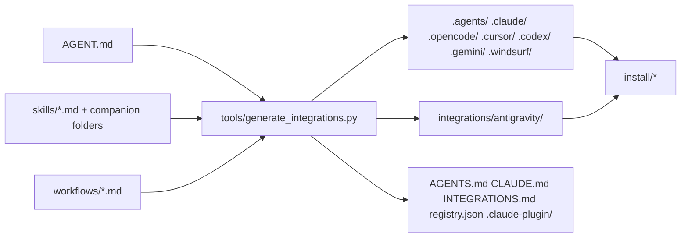

# System

## Context
Maintainers edit canonical files; the generator derives every agent-specific format; installers copy the derived output to users.

## Components
- [orchestrator](../30-units/orchestrator/README.md)
- [catalog](../30-units/catalog/README.md)
- [generator](../30-units/generator/README.md)
- [installers](../30-units/installers/README.md)
- [docs-scaffold](../30-units/docs-scaffold/README.md)

## Flows

